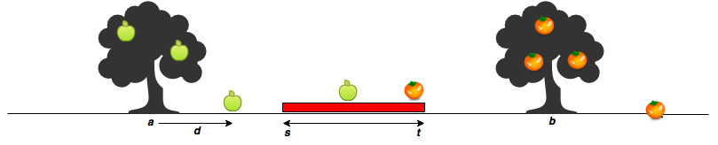

## Apple and Orange

Sam's house has an apple tree and an orange tree that yield an abundance of fruit. Using the information given below, determine the number of apples and oranges that land on Sam's house.

In the diagram below:

- The red region denotes the house, where _s_ is the start point, and _t_ is the endpoint. The apple tree is to the left of the house, and the orange tree is to its right.
- Assume the trees are located on a single point, where the apple tree is at point _a_, and the orange tree is at point _b_.
- When a fruit falls from its tree, it lands _d_ units of distance from its tree of origin along the _x-axis_. A negative value of _d_ means the fruit fell _d_ units to the tree's left, and a positive value of _d_ means it falls _d_ units to the tree's right.



Given the value of _d_ for _m_ apples and _n_ oranges, determine how many apples and oranges will fall on Sam's house (i.e., in the inclusive range _[s, t]_)?

For example, Sam's house is between _s = 7_ and _t = 10_. The apple tree is located at _a = 4_ and the orange at _b = 12_. There are _m = 3_ apples and _n = 3_ oranges. Apples are thrown _**apples = [2, 3, -4]**_ units distance from _a_, and _**oranges = [3, -2, -4]**_ units distance. Adding each apple distance to the position of the tree, they land at _[4 + 2, 4 + 3, 4 + -4] = [6, 7, 0]_. Oranges land at _[12 + 3, 12 + -2, 12 + -4] = [15, 10, 8]_. One apple and two oranges land in the inclusive range _7 - 10_ so we print

```
1
2
```

#### Function Description

The function should print the number of apples and oranges that land on Sam's house, each on a separate line.

The function has the following parameter(s):

- **s**: integer, starting point of Sam's house location.
- **t**: integer, ending location of Sam's house location.
- **a**: integer, location of the Apple tree.
- **b**: integer, location of the Orange tree.
- **apples**: integer array, distances at which each apple falls from the tree.
- **oranges**: integer array, distances at which each orange falls from the tree.

#### Input Format

- The first line contains two space-separated integers denoting the respective values of _s_ and _t_.
- The second line contains two space-separated integers denoting the respective values of _a_ and _b_.
- The third line contains two space-separated integers denoting the respective values of _m_ and _n_.
- The fourth line contains _m_ space-separated integers denoting the respective distances that each apple falls from point _a_.
- The fifth line contains _n_ space-separated integers denoting the respective distances that each orange falls from point _b_.

#### Constraints

- 1 <= s, t, a, b, m, n <= 10^5
- -10^5 <= d <= 10^5
- a < s < t < b

#### Output Format

Print two integers on two different lines:

- **The first integer**: the number of apples that fall on Sam's house.
- **The second integer**: the number of oranges that fall on Sam's house.
