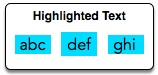

## Designer PDF Viewer

When a contiguous block of text is selected in a PDF viewer, the selection is highlighted with a blue rectangle. In this PDF viewer, each word is highlighted independently. For example:



There is a list of `26` character heights aligned by index to their letters. For example, 'a' is at index `0` and 'z' is at index `25`. There will also be a string. Using the letter heights given, determine the area of the rectangle highlight in `mm^2` assuming all letters are `1mm` wide.

#### Example

```
h = [1, 3, 1, 3, 1, 4, 1, 3, 2, 5, 5, 5, 5, 1, 1, 5, 5, 1, 5, 2, 5, 5, 5, 5, 5, 5]
word = "torn"
```

The heights are `t = 2, o = 1, r = 1` and `n = 1`. The tallest letter is `2` high and there are `4` letters. The highlighted area will be `2 * 4 = 8mm^2` so the answer is `8`.

#### Function Description

designerPdfViewer has the following parameter(s):

-`int h[26]`: the heights of each letter

- `string word`: a string

#### Returns

- `int`: the size of the highlighted area

#### Input Format

- The first line contains `26` space-separated integers describing the respective heights of each consecutive lowercase English letter, ascii[a-z].

- The second line contains a single word consisting of lowercase English alphabetic letters.

#### Constraints

- `1 <= h[?] <= 7`, where `?` is an English lowercase letter.
- `word` contains no more than `10` letters.
